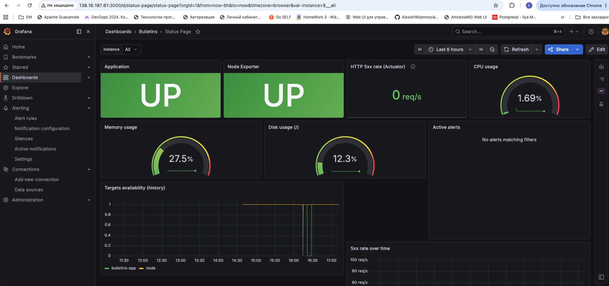
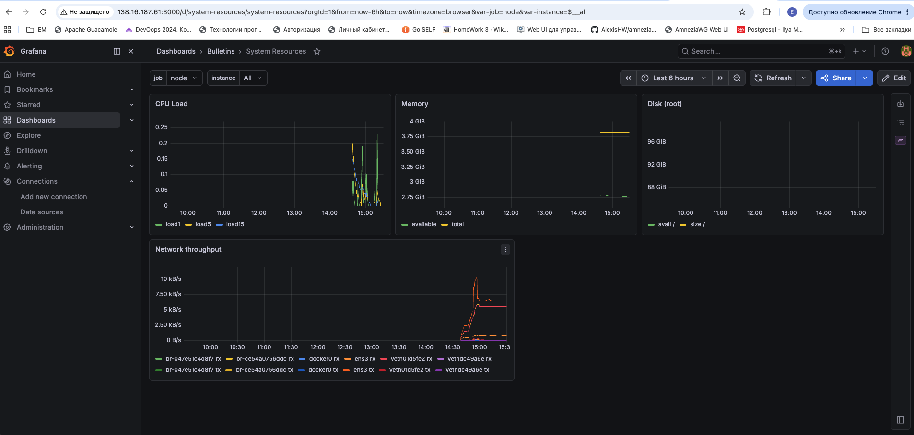
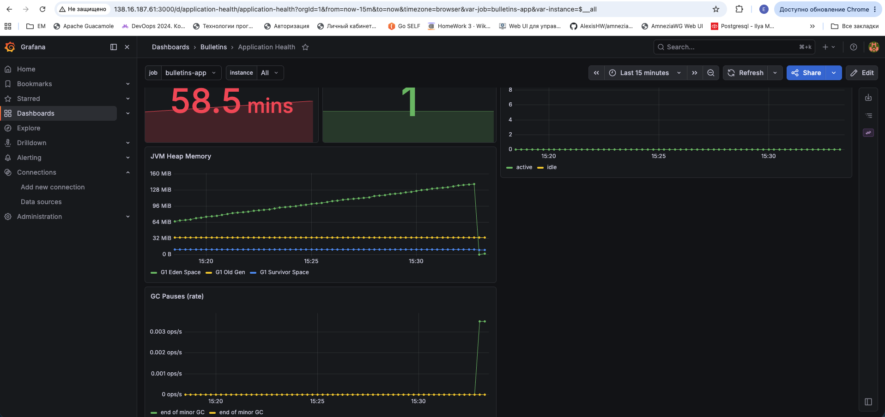
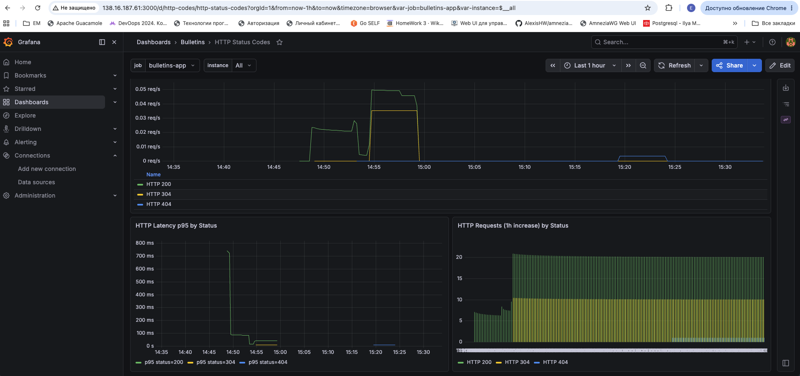
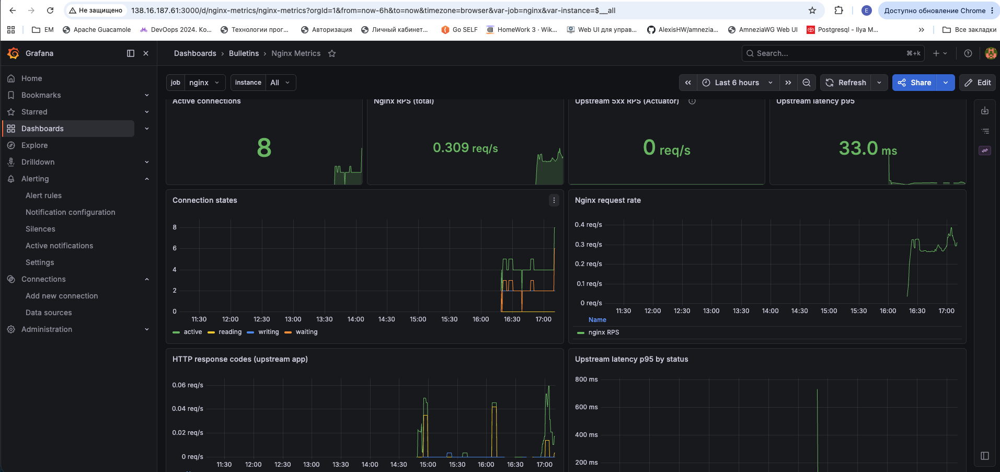
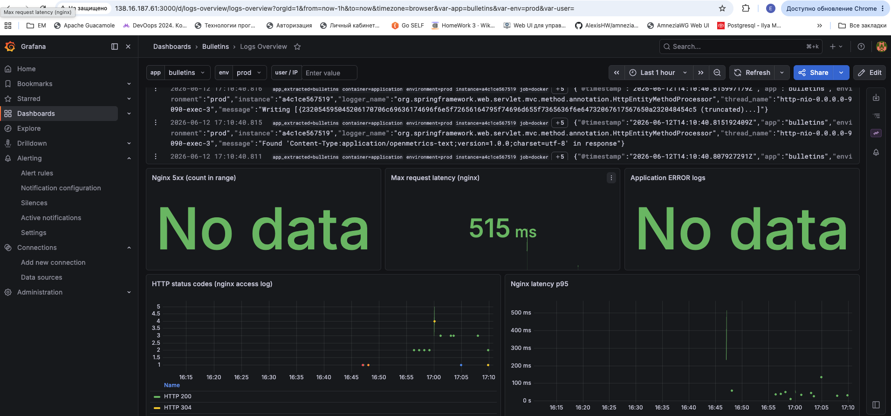

# Скриншоты мониторинга

Визуальная документация Grafana-дашбордов production-окружения [task.devops-campus.ru](https://task.devops-campus.ru).

| Параметр | Значение |
|----------|----------|
| Grafana | http://138.16.187.61:3000 |
| Папка дашбордов | **Bulletins** |
| Источники данных | Prometheus (`node`, `bulletins-app`, `nginx`) + Loki |

Подробный список обязательных метрик: [monitoring/required-metrics.md](monitoring/required-metrics.md).

---

## Status Page

**UID:** `status-page` · [открыть в Grafana](http://138.16.187.61:3000/d/status-page)

Сводная «страница статуса»: доступность сервисов, ресурсы хоста, HTTP 5xx и активные алерты.

| Панель | Что показывает |
|--------|----------------|
| Application / Node Exporter | `up{job="bulletins-app"}` и `up{job="node"}` — оба **UP** |
| CPU / Memory / Disk | загрузка app VM (`node_*` метрики) |
| HTTP 5xx rate | ошибки приложения через Actuator |
| Targets availability | история доступности scrape-таргетов Prometheus |
| Active alerts | текущие срабатывания Grafana Alerting |

---

## System Resources

**UID:** `system-resources` · [открыть в Grafana](http://138.16.187.61:3000/d/system-resources)

Системные метрики app VM с **Node Exporter** (`job=node`).

| Панель | Метрики |
|--------|---------|
| CPU Load | `node_load1`, `node_load5`, `node_load15` |
| Memory | `node_memory_MemAvailable_bytes`, `node_memory_MemTotal_bytes` |
| Disk (root) | `node_filesystem_avail_bytes`, `node_filesystem_size_bytes` |
| Network throughput | `node_network_receive_bytes_total`, `node_network_transmit_bytes_total` |

---

## Application Health

**UID:** `application-health` · [открыть в Grafana](http://138.16.187.61:3000/d/application-health)

JVM и runtime Spring Boot (`job=bulletins-app`, scrape `/actuator/prometheus`).

| Панель | Метрики |
|--------|---------|
| Uptime | `process_uptime_seconds` |
| JVM Heap | `jvm_memory_used_bytes` по областям heap |
| GC Pauses | `jvm_gc_pause_seconds_count` |
| HikariCP | `hikaricp_connections_active`, `hikaricp_connections_idle` |

---

## HTTP Status Codes

**UID:** `http-codes` · [открыть в Grafana](http://138.16.187.61:3000/d/http-codes)

HTTP-трафик приложения по кодам ответа и латентности (Micrometer / Actuator).

| Панель | Назначение |
|--------|------------|
| Request Rate | RPS по кодам 200 / 304 / 404 / 5xx |
| HTTP Latency p95 | 95-й перцентиль времени ответа |
| HTTP Requests (1h increase) | прирост запросов за час |

---

## Nginx Metrics

**UID:** `nginx-metrics` · [открыть в Grafana](http://138.16.187.61:3000/d/nginx-metrics)

Метрики reverse proxy: **nginx-prometheus-exporter** + `stub_status` (`job=nginx`).

| Панель | Метрики |
|--------|---------|
| Active connections | `nginx_connections_active` |
| Nginx RPS | `rate(nginx_http_requests_total[1m])` |
| Upstream 5xx RPS | коды 5xx от backend (Actuator) |
| Upstream latency p95 | латентность upstream по статусам |
| Connection states | reading / writing / waiting |

Endpoint снаружи: `https://task.devops-campus.ru:9090/nginx/metrics`

---

## Logs Overview

**UID:** `logs-overview` · [открыть в Grafana](http://138.16.187.61:3000/d/logs-overview)

Логи из **Loki** (Promtail на app VM): application, nginx access, docker.

| Панель | LogQL / источник |
|--------|------------------|
| Log stream | `{app="bulletins", env="prod"}` |
| Nginx 5xx (count) | `{job="nginx-access"} \| json \| status >= 500` |
| Max request latency | `{job="nginx-access"} \| json \| request_time` |
| Application ERROR logs | `{app="bulletins"} \| json \| level="ERROR"` |
| HTTP status codes | nginx JSON access log |
| Nginx latency p95 | nginx access log, поле `request_time` |

E2E-проверка: запись `promtail-e2e-test` в `/var/log/bulletins/e2e-test.log` → Explore → Loki.

---

## Alert (Telegram)

Contact point: **`telegram-alerts`** · [Alert rules](http://138.16.187.61:3000/alerting/list)

Критичные правила (папка **Bulletins**, группа `bulletins-alerts`):

| Правило | Условие |
|---------|---------|
| Application target down | `up{job="bulletins-app"} < 1` |
| Node exporter missing | `up{job="node"} < 1` |
| High HTTP 5xx rate | 5xx > 0.05 req/s |
| Log 5xx spike (Loki) | >10 записей 5xx/5m в access-log |
| High CPU / Memory / Disk | пороги из `group_vars/monitoring.yml` |
